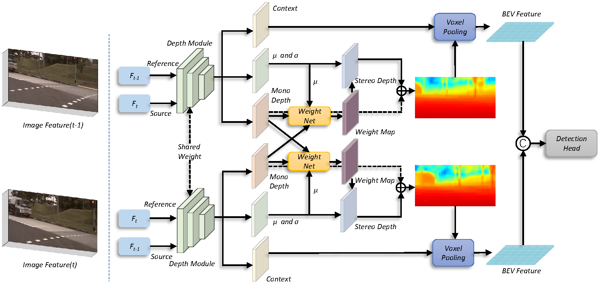

## BEVStereo
BEVStereo is a new multi-view 3D object detector using temporal stereo to enhance depth estimation.



## Quick Start
### Installation
**Step 0.** Install [pytorch](https://pytorch.org/)(v1.9.0).

**Step 1.** Install [MMDetection3D](https://github.com/open-mmlab/mmdetection3d)(v1.0.0rc4).

**Step 2.** Install requirements.
```shell
pip install -r requirements.txt
```
**Step 3.** Install BEVDepth(gpu required).
```shell
python setup.py develop
```

### Data preparation
We use the same data format as [BEVDepth](https://github.com/Megvii-BaseDetection/BEVDepth), if you have processed it before, please skip.

**Step 0.** Download nuScenes official dataset.

**Step 1.** Symlink the dataset root to `./data/`.
```
ln -s [nuscenes root] ./data/
```
The directory will be as follows.
```
BEVDepth
├── data
│   ├── nuScenes
│   │   ├── maps
│   │   ├── samples
│   │   ├── sweeps
│   │   ├── v1.0-test
|   |   ├── v1.0-trainval
```
**Step 2.** Prepare infos.
```
python scripts/gen_info.py
```
**Step 3.** Prepare depth gt.
```
python scripts/gen_depth_gt.py
```

### Tutorials
**Train.**
```
python [EXP_PATH] --amp_backend native -b 8 --gpus 8
```
**Eval.**
```
python [EXP_PATH] --ckpt_path [CKPT_PATH] -e -b 8 --gpus 8
```
### Benchmark
|Backbone |mAP |mATE| mASE | mAOE |mAVE| mAAE | NDS | weights |
| ------ | :---:       |:---:     |:---:  | :---: | :----: | :----: | :----: | :----: |
|[R50](exps/bev_stereo_lss_r50_256x704_128x128_24e_2key.py)| 0.3494 |  0.6671     |0.2785 | 0.5606 | 0.4686 | 0.2295 | 0.4543 | [github](https://github.com/Megvii-BaseDetection/BEVStereo/releases/download/v0.0.1/bev_stereo_lss_r50_256x704_128x128_24e_2key.pth)

## Acknowledgments
This project exists thanks to all the people who instruct.
[@Haotian-Zh](https://github.com/Tinyyyy) [@xavierwu95](https://github.com/xavierwu95) [@Tai-Wang](https://github.com/Tai-Wang)
